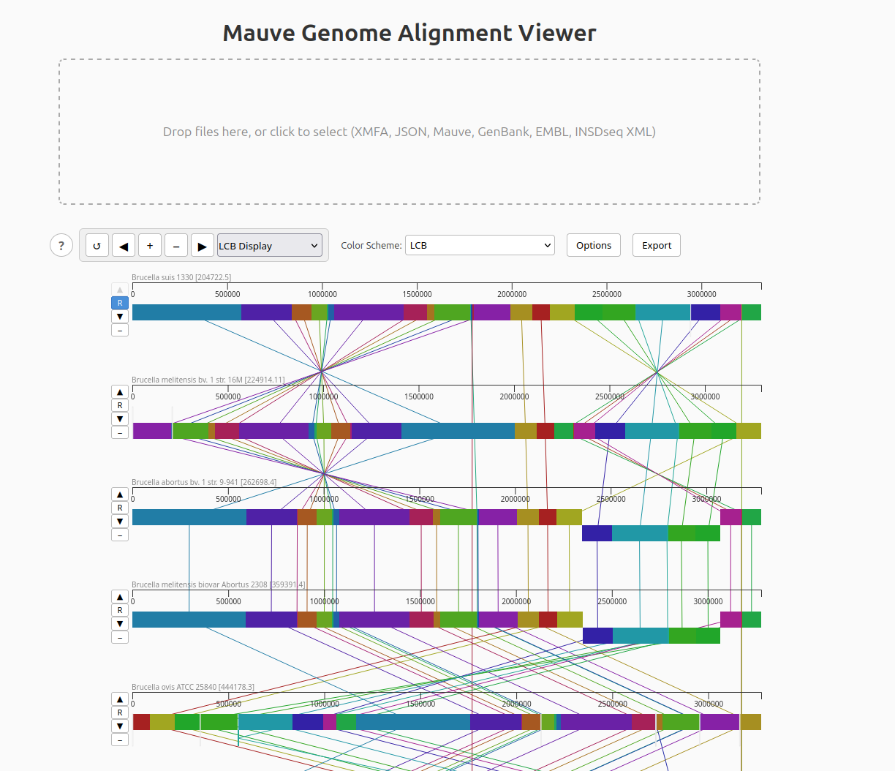

# Mauve Viewer

> Interactive visualization and analysis of multi-genome alignments in the browser.

A modern web reimplementation of the [Mauve](https://github.com/koadman/mauve) genome alignment viewer, inspired by [PATRIC3/mauve-viewer](https://github.com/PATRIC3/mauve-viewer).

## Disclaimer

This project is built entirely using Claude Opus 4.6. It follows a specification-driven development approach based on the original Mauve project, using subagents and instruction files to enforce coding standards, testing, and feature completeness. The project in its current state may contain bugs. Bug reports are welcome via [issues](https://github.com/jonperron/mauve-viewer/issues).

## Highlights

- Visualize multi-genome alignments with colored Locally Collinear Blocks (LCBs) and connecting lines
- Three display modes: LCB overview, ungapped matches, and similarity profiles
- Zoom from full-genome overview down to individual nucleotides (1x to 100,000x)
- Overlay genomic annotations (CDS, tRNA, rRNA) with hover tooltips and NCBI links
- Export SNPs, gaps, permutations, positional orthologs, identity matrices, and more
- Drag-and-drop file loading with automatic format detection (XMFA, GenBank, EMBL, and others)
- Multiple [color schemes](doc/color-schemes.md) highlighting conservation, multiplicity, and rearrangements



## Usage

1. Open Mauve Viewer in your browser.
2. Drag and drop an alignment file (`.xmfa`, `.mauve`, `.json`) onto the drop zone, or click to pick a file.
3. Optionally load annotation files (`.gbk`, `.embl`, `.xml`) alongside the alignment.
4. Explore: zoom with Ctrl+scroll, pan by dragging, hover to see homologous positions across genomes.

See the [File Formats](doc/file-formats.md) guide for all supported formats and limits.

## Installation

Requires [Node.js](https://nodejs.org/) 24 or later.

```bash
git clone https://github.com/jonperron/mauve-viewer.git
cd mauve-viewer
npm install
npm run dev
```

The development server starts at `http://localhost:5173`.

### Docker

A `Dockerfile` is included. Pre-built images are available from the [container registry](https://github.com/jonperron/mauve-viewer/pkgs/container/mauve-viewer):

```bash
docker pull ghcr.io/jonperron/mauve-viewer
docker run -p 8080:80 ghcr.io/jonperron/mauve-viewer
```

## Documentation

Full user guides are available in the [documentation](doc/README.md):

- [File Formats](doc/file-formats.md) — Supported input and auxiliary formats
- [Viewer](doc/viewer.md) — Multi-panel layout and display modes
- [Navigation](doc/navigation.md) — Zoom, pan, cursor, region selection, and feature search
- [Annotations](doc/annotations.md) — Genomic feature display and interaction
- [Color Schemes](doc/color-schemes.md) — Coloring options for alignment blocks
- [Genome Controls](doc/genome-controls.md) — Reorder, hide, and set reference genome
- [Data Export](doc/export.md) — Export SNPs, gaps, permutations, orthologs, and more
- [Image Export and Print](doc/image-export-and-print.md) — Save images and print
- [Keyboard Shortcuts](doc/keyboard-shortcuts.md) — Quick reference

## Feedback and Contributing

Found a bug or have a feature request? [Open an issue](https://github.com/jonperron/mauve-viewer/issues).

## Citation

If you use Mauve Viewer in your research, please cite the original Mauve papers:

> Darling, A.E., Mau, B., and Perna, N.T. (2010) progressiveMauve: Multiple Genome Alignment with Gene Gain, Loss and Rearrangement. *PLoS ONE*, 5(6): e11147. doi:[10.1371/journal.pone.0011147](https://doi.org/10.1371/journal.pone.0011147)

> Darling, A.C.E., Mau, B., Blattner, F.R., and Perna, N.T. (2004) Mauve: Multiple Alignment of Conserved Genomic Sequence With Rearrangements. *Genome Research*, 14(7): 1394–1403. doi:[10.1101/gr.2289704](https://doi.org/10.1101/gr.2289704)

## License

[MIT](LICENSE)
