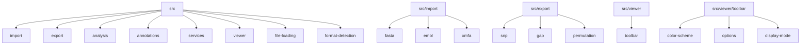

# Code Organization

## Folder Overview

- **src/import/**: Parsers and types for supported input formats. Each format has its own subfolder.
  - **src/import/file-loading/**: File loading and detection utilities.
  - **src/import/format-detection/**: Detects file formats for import.
- **src/export/**: Code for exporting data in various formats. Each export type has its own subfolder.
- **src/analysis/**: Algorithms and analysis tools, except for export logic.
- **src/annotations/**: Annotation parsing and management.
- **src/services/**: External data services and API integrations.
- **src/viewer/**: UI components and visualization logic.
  - **src/viewer/toolbar/**: All code related to toolbars.
    - **color-scheme/**: Color scheme logic and menus for the toolbar.
    - **options/**: Options panel logic, print and image export for the toolbar.
    - **display-mode/**: Display mode selector and related logic for the toolbar.

## Import/Export Structure

- **src/import/[format]/**: All code for parsing a specific format (e.g., fasta, embl, xmfa).
- **src/export/[type]/**: All code for exporting a specific data type (e.g., snp, gap, permutation).

## Visual Overview

Each folder is self-contained and minimizes dependencies on others. This makes the codebase easy to navigate and maintain.
