# Code Organization

## Folder Overview

- **src/import/**: Parsers and types for supported input formats. Each format has its own subfolder.
  - **src/import/file-loading/**: File loading and detection utilities.
  - **src/import/format-detection/**: Detects file formats for import.
- **src/export/**: Code for exporting data in various formats. Each export type has its own subfolder.
- **src/analysis/**: Algorithms and analysis tools, except for export logic.
  - **src/analysis/dcj/**: DCJ, breakpoint, and SCJ distance computation and permutation model.
  - **src/analysis/grimm/**: GRIMM-style reversal analysis and sorting scenarios.
  - **src/analysis/backbone/**: Backbone segment computation and island detection.
  - **src/analysis/weakarg/**: WeakARG XML parsing and recombination histogram building.
  - **src/analysis/similarity/**: Similarity index computation.
- **src/alignment/**: Client-side job submission and polling for genome alignment jobs.
- **src/scoring/**: Assembly quality scoring: structural metrics, sequence metrics, contig statistics, CDS quality, content metrics, report dialog, and API client.
- **src/contig-reorder/**: Client-side job submission, polling, and result handling for contig reordering.
- **src/annotations/**: Annotation parsing and management.
- **src/services/**: External data services and API integrations.
- **src/viewer/**: UI components and visualization logic.
  - **src/viewer/toolbar/**: All code related to toolbars.
    - **color-scheme/**: Color scheme logic and menus for the toolbar.
    - **options/**: Options panel logic, print and image export for the toolbar.
    - **display-mode/**: Display mode selector and related logic for the toolbar.

## Server Modules

- **server/**: Express server providing the backend API.
  - **server/alignment/**: Routes and job management for genome alignment (`/api/align`).
  - **server/contig-reorder/**: Routes and job management for contig reordering (`/api/reorder`).
  - **server/scoring/**: Routes and job management for assembly scoring (`/api/score`).

## Import/Export Structure

- **src/import/[format]/**: All code for parsing a specific format (e.g., fasta, embl, xmfa).
- **src/export/[type]/**: All code for exporting a specific data type (e.g., snp, gap, permutation).

## Visual Overview

```mermaid
graph TD
  src --> import
  src --> export
  src --> analysis
  src --> alignment
  src --> scoring
  src --> contig-reorder
  src --> annotations
  src --> services
  src --> viewer
  import --> file-loading
  import --> format-detection
  src/import --> fasta
  src/import --> embl
  src/import --> xmfa
  src/export --> snp
  src/export --> gap
  src/export --> permutation
  src/export --> cds-errors
  src/export --> homolog
  src/export --> identity-matrix
  src/export --> summary
  src/analysis --> dcj
  src/analysis --> grimm
  src/analysis --> backbone
  src/analysis --> weakarg
  src/viewer --> toolbar
  src/viewer/toolbar --> color-scheme
  src/viewer/toolbar --> options
  src/viewer/toolbar --> display-mode
  server --> server/alignment
  server --> server/contig-reorder
  server --> server/scoring
```

Each folder is self-contained and minimizes dependencies on others. This makes the codebase easy to navigate and maintain.
